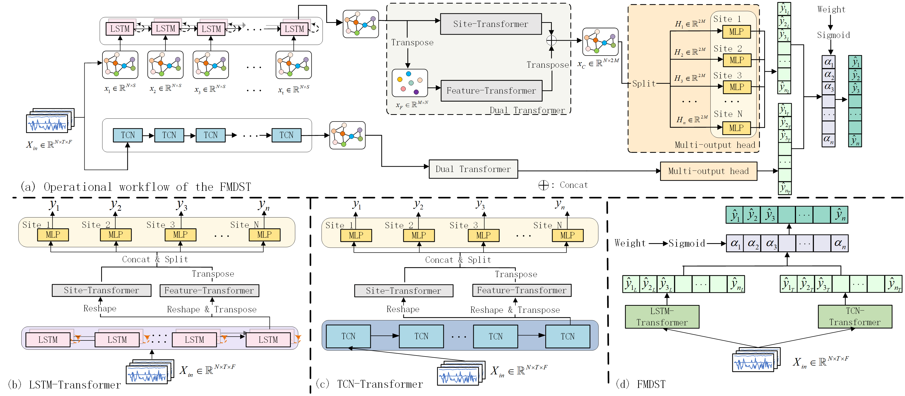

# FMDST: Fusion Multi-site Dual-Spatiotemporal Networks for Wind Power Forecasting

## Description

In this paper, we propose a deep learning framework, FMDST model, which leverages spatio-temporal correlations among different sites to achieve ultra-short-term multi-step ahead forecasting for multi-site wind power.

## Project Structure
FMDST/
├── Ablation_model/                                     # Contains all ablation models.
├── Data_Preprocessing/                                 # Scripts for data processing and dataset creation.
│   ├── data_clean/                                     # Cleaning missing and abnormal values.
│   ├── data_preprocess/                                # Pre-generation of train/val/test input sequences.
│   └── MIC/                                            # feature selection and visualization using MIC.
├── model/                                              # Implementation of the proposed and baseline models.
├── model_save/                                         # Saved model files.
├── sdwpf_kddcup/                                       # Dataset files.
│   ├── sdwpf_245days_v1.csv/                           # Raw wind power data.
│   ├── sdwpf_baidukddcup2022_turb_location.csv/        # Relative locations of all wind turbines..
│   └── Cleaned_data_with_power.csv/                    # Data with missing and outlier values corrected.
├── AVG.py                                              # Script to compute average results over multiple runs.
├── main.py                                             # Main entry point.
├── train_evaluate.py                                   # Code for model training and evaluation.
└── README.md                                           # Project documentation.

## Dataset

The dataset used in this project is **SDWPF (Spatial Dynamic Wind Power Forecasting)**, which was released for the **Baidu KDD Cup 2022** challenge.  You can view and download the dataset [here](https://aistudio.baidu.com/competition/detail/152/0/introduction) after registration.

